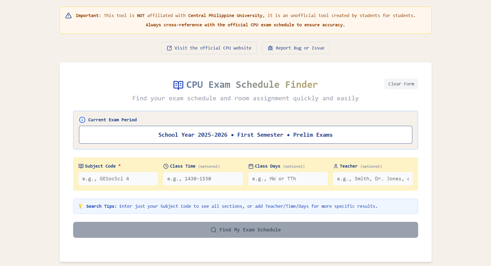
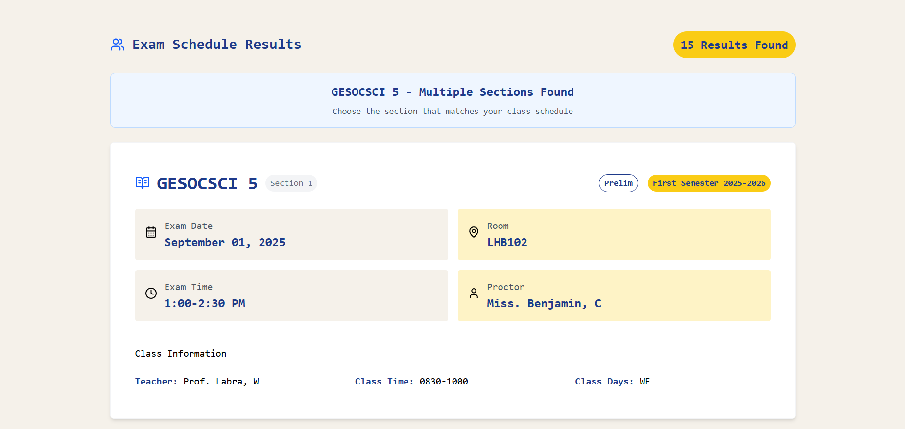
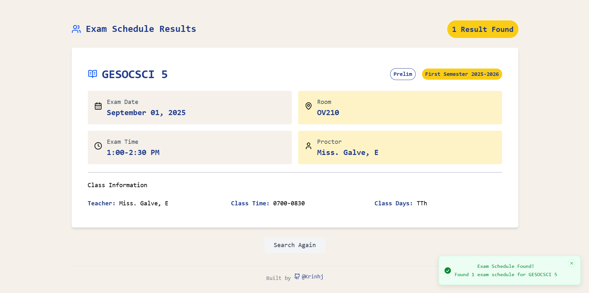
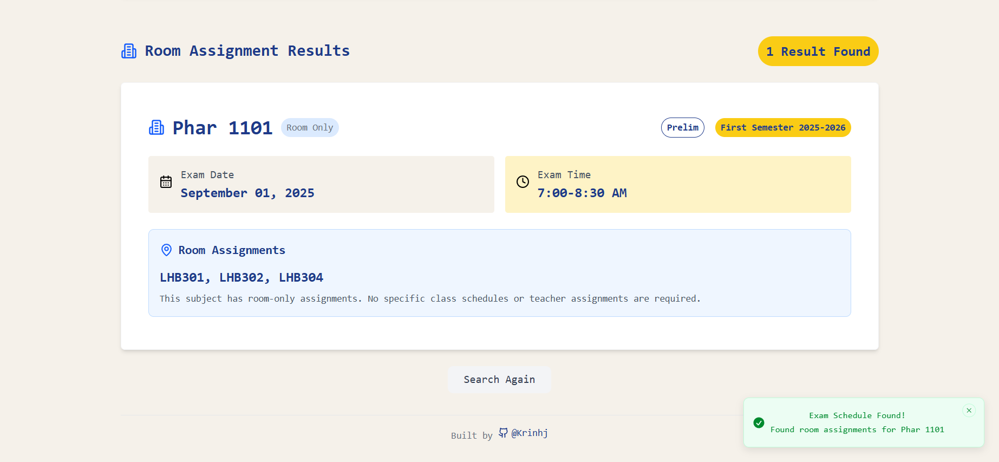
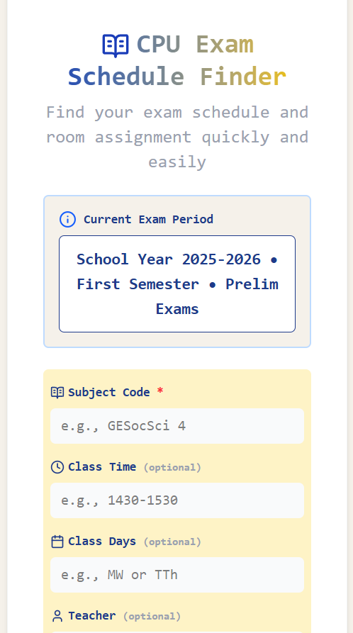
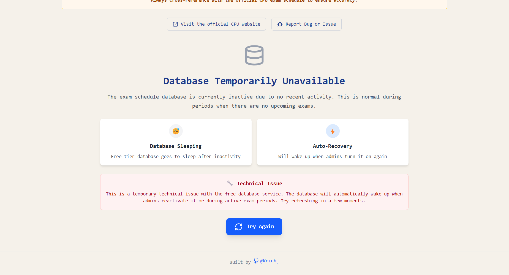
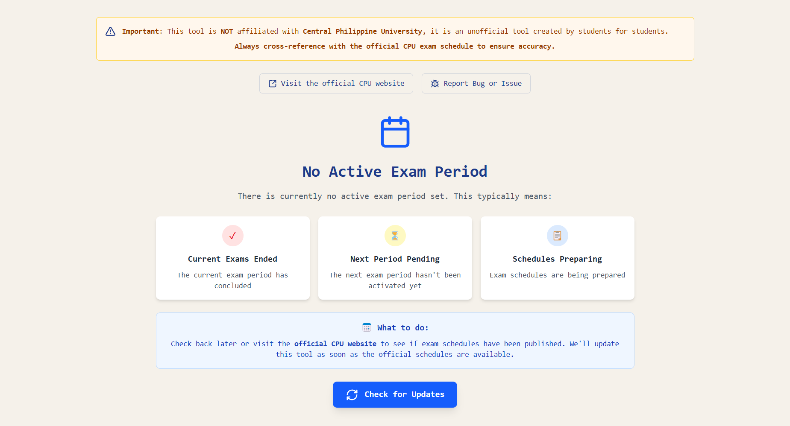

# CPU Exam Schedule Finder

**🔍 A searchable exam schedule finder for Central Philippine University students**

**Live Site:** [cpuexamfinder.vercel.app](https://cpuexamfinder.vercel.app)

---

## 📖 The Problem

Central Philippine University posts exam schedules on their official website as **scanned PDF images of printed schedules**. This means students can't use **Ctrl+F** to search for their subjects - they have to manually scan through pages of images to find their exam times and rooms.

As a recent CPU graduate (June 2025), I built this tool to solve this pain point for current students, starting with helping my brother find his exam schedules more easily.

---

## ✨ The Solution

A modern, searchable web application where students can:

- **🔍 Search by subject code** with optional filters for teacher, class time, and days
- **📱 Access on any device** - fully mobile responsive
- **⚡ Get instant results** with exam date, time, room, and proctor information
- **🎯 Find room-only subjects** that just need location assignments

---

## 🚀 Features

### For Students

- **Smart Search** - Enter just your subject code, or add teacher/time/days for specific results
- **Live Validation** - Real-time form validation and helpful error messages
- **Current Exam Period** - Automatically displays active exam period information
- **Mobile Optimized** - Works perfectly on phones, tablets, and desktops
- **CPU Branding** - Familiar university colors and styling
- **Instant Feedback** - Toast notifications for search results and errors

### Technical Features

- **Modern React Stack** - Built with React 19, TypeScript, and Tailwind CSS
- **Real-time Database** - Powered by Supabase with Express.js API
- **Smart Error Handling** - Distinguishes between database issues and no results
- **Performance Optimized** - Fast loading and efficient search queries

---

## 🌐 Live Deployment

- **Frontend:** Deployed on Vercel at [cpuexamfinder.vercel.app](https://cpuexamfinder.vercel.app)
- **Backend:** API server deployed on Render
- **Database:** Supabase PostgreSQL database

---

## 📸 Screenshots

### Main Search Interface

*Clean, intuitive search form with CPU branding and real-time validation*

### Search Results Display

*Detailed exam schedule results with date, time, room, and proctor information*


*Multiple search results showing different class sections*


*Additional search results demonstrating flexible filtering capabilities*

### Mobile-Responsive Design

*Fully responsive interface optimized for mobile devices*

### Error State Handling

*Smart error handling - Database Down page with retry functionality and user guidance*


*No Active Exam Period page - shown when no exam period is currently active*

---

## 🏗️ Architecture

```
Frontend (Vercel)     →     Backend API (Render)     →     Database (Supabase)
React + TypeScript           Express.js + Node.js           PostgreSQL
```

**Repository Structure:**

```
cpu-exam-schedule-finder/
├── client/           # Student-facing React application
├── server/           # Express.js API server
└── SQL Queries/      # Database schema and sample queries
```

---

## 💻 Tech Stack

**Frontend:**

- React 19 with TypeScript
- Tailwind CSS 4 for styling
- Vite for fast development
- Lucide React for icons
- Sonner for toast notifications

**Backend:**

- Node.js with Express.js 5
- Supabase for database and auth
- CORS enabled for cross-origin requests

---

## 🚦 Getting Started

### Prerequisites

- Node.js 18+ and npm
- Supabase account (for database)

### Local Development

1. **Clone the repository**

   ```bash
   git clone https://github.com/yourusername/cpu-exam-schedule-finder.git
   cd cpu-exam-schedule-finder
   ```

2. **Set up the backend**

   ```bash
   cd server
   npm install
   # Configure .env file (see server/README.md)
   npm start
   ```

3. **Set up the frontend**
   ```bash
   cd ../client
   npm install
   # Configure .env file (see client/README.md)
   npm run dev
   ```

For detailed setup instructions, see the individual README files in `/client` and `/server` folders.

---

## ⚠️ Important Disclaimers

- **Unofficial Tool:** This is not officially affiliated with Central Philippine University
- **Personal Project:** Built by a recent graduate to help fellow CPU students
- **Limited Data:** Current data is incomplete and used for system testing
- **Best Effort:** While accurate, always verify exam schedules with official CPU sources

---

## 🔮 Future Plans

- **Complete Data Integration:** Planning to add full exam schedules for the next exam period (Midterm Exams)
- **Official Integration:** Exploring opportunities to pitch this system to CPU for official adoption
- **Expanded Features:** Potential for additional academic tools and integrations

---

## 📱 How to Use

1. Visit [cpuexamfinder.vercel.app](https://cpuexamfinder.vercel.app)
2. Enter your **Subject Code** (required) - e.g., "GESocSci 4"
3. Optionally add **Teacher Name**, **Class Time**, or **Class Days** for more specific results
4. Click **"Find My Exam Schedule"**
5. View your exam date, time, room, and proctor information

---

## 📧 Contact

For questions, suggestions, or if you're from CPU and interested in official integration:
**ron.talabuconjr.dev@gmail.com**

---

## 📄 License

This project is licensed under the MIT License - see the [LICENSE](LICENSE) file for details.

---

**Built by a CPU graduate for the CPU community**
